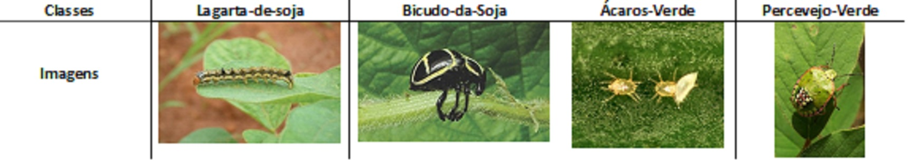

# classifier-soy
Classification soybearn insects using deep learning.

This repository tests the result of a convolutional neural network using regional soy pest repositories as a database. For training, 7 classes of 625 images were divided, resulting in an accuracy of 94% using cross validation.

